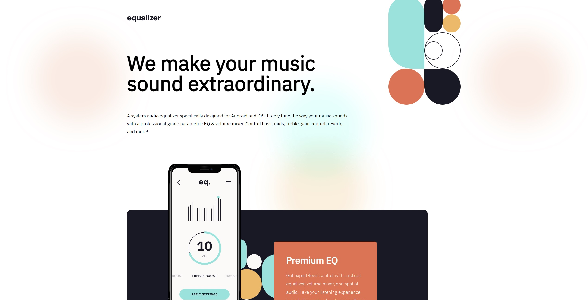

# Frontend Mentor - Equalizer landing page solution

This is a solution to the [Equalizer landing page challenge on Frontend Mentor](https://www.frontendmentor.io/challenges/equalizer-landing-page-7VJ4gp3DE). Frontend Mentor challenges help you improve your coding skills by building realistic projects. 

## Table of contents

- [Overview](#overview)
  - [The challenge](#the-challenge)
  - [Screenshot](#screenshot)
  - [Links](#links)
  - [Built with](#built-with)
  - [What I learned](#what-i-learned)
  - [Continued development](#continued-development)

**Note: Delete this note and update the table of contents based on what sections you keep.**

## Overview

### The challenge

Users should be able to:

- View the optimal layout depending on their device's screen size
- See hover states for interactive elements

### Screenshot

Add a screenshot of your solution. The easiest way to do this is to use Firefox to view your project, right-click the page and select "Take a Screenshot". You can choose either a full-height screenshot or a cropped one based on how long the page is. If it's very long, it might be best to crop it.

Alternatively, you can use a tool like [FireShot](https://getfireshot.com/) to take the screenshot. FireShot has a free option, so you don't need to purchase it. 

Then crop/optimize/edit your image however you like, add it to your project, and update the file path in the image above.

**Note: Delete this note and the paragraphs above when you add your screenshot. If you prefer not to add a screenshot, feel free to remove this entire section.**

### Links

- Solution URL: https://github.com/Nazemrap/responsive
- Live Site URL: https://nazemrap.github.io/responsive/
## My process

### Built with

- HTML5
- CSS - Flexbox

via VSC

### What I learned

 - Use of media query and responsiveness
 - organize my work for a responsive design and make a clearer code. 
 - the different mesure units (vh, em, rem) // didn't used them a lot but i've done search on them and there uses. 
 - max-heigth/ min-with and vice-versa.
 - understand better the flex system

### Continued development

- Organisation. I think i made it upside down, i should have start with the easiest layout (the phone) and add more complixity (the bigger screen size).
- use more flexible mesure units.
